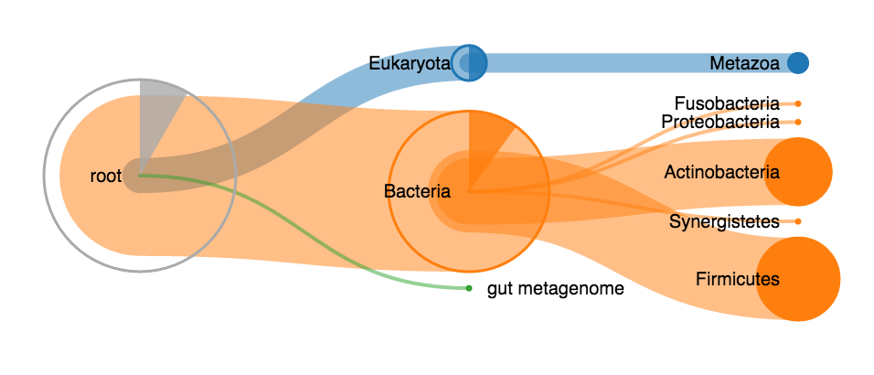
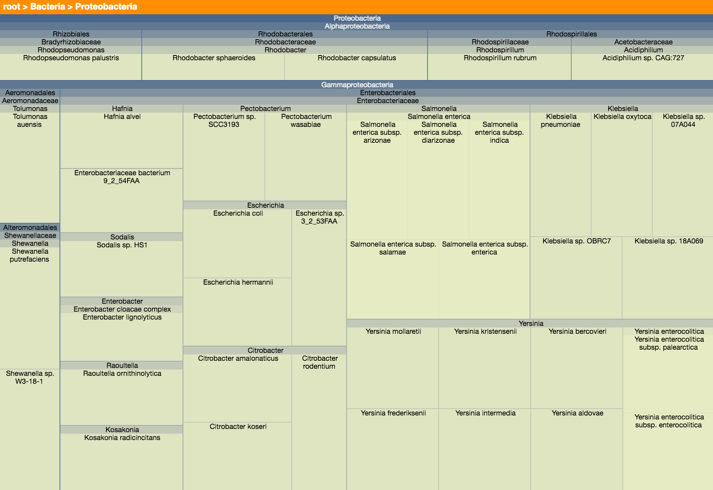
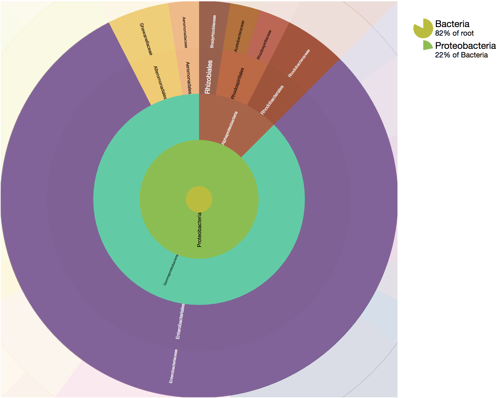
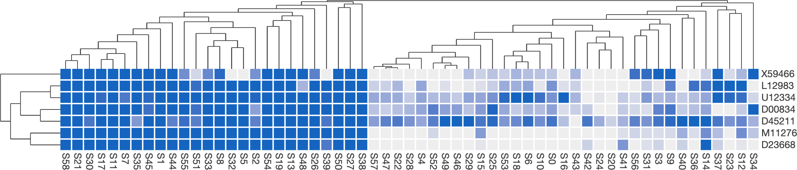

# Unipept visualizations
This repository contains stand-alone versions of the Unipept visualizations. At this time, a treeview, a treemap, a sunburst graph and a heatmap are available. The complete package has been written in TypeScript and uses D3 (v6) internally and is aimed at rendering vast amounts of data as fast as possible. Most visualizations are SVG-based, but an HTML Canvas has been used where necessary to make sure performance is as high as possible.

## Requirements
[D3.js](https://d3js.org/) (version 6.x should do) and is required to use these visualizations. The code is written using JavaScript ES2020 features, but a transpiled ES6-compatible version (`unipept-visualizations.js`) that should work in all modern browsers is available in the [`dist`](dist) directory.

[comment]: <> (A live example of this visualization can be found [on http://bl.ocks.org/bmesuere/162572f2d70c1a3a3e09]&#40;http://bl.ocks.org/bmesuere/162572f2d70c1a3a3e09&#41; with additional examples in the examples directory.)

## Installation and use
1. Download and include [`unipept-visualizations.min.js`](dist/unipept-visualizations.js) on your page
2. Include D3
3. Add a div with an id (for example `

`) to your page
4. Initialize the treeview by invoking `treeview()` or `treemap()` with the div-element. For example `const treeview = new UnipeptVisualizations.Treeview(document.getElementById("example"), data, options);`

## Documentation
Head over to our [GitHub Wiki](https://github.com/unipept/unipept-visualizations/wiki) for the full documentation of this package.

## Treeview

### The data object
The data object is a hierarchical Node object. It consists out of:
* `id`: A way to uniquely identify the node
* `name`: The name of the node
* `data`: An object containing additional data of choice
* `children` (optional): An array containing one or more node objects that are the children of the current object

### The options object
The options object is an optional parameter and allows to override the default visualization settings.

#### Values
* `height` (default: 300): The height in pixels of the visualization.
* `width` (default: 600): The width in pixels of the visualization.
* `levelsToExpand` (default: 2): The number of levels to expand after clicking on a node and when loading the initial visualization.
* `nodeDistance` (default: 180): The horizontal distance in pixels between nodes.
* `minNodeSize` (default: 2): The minimal size of a node in pixels.
* `maxNodeSize` (default: 105): The maximal size of a node in pixels.
* `enableInnerArcs` (default: true): Should the inner arcs be shown?
* `enableTooltips` (default: true): Should tooltips be shown on mouseover?
* `enableExpandOnClick` (default: true): Should the tree collapse and expand when clicking on nodes? If disabled, the entire tree is automatically expanded when loaded.
* `enableRightClick` (default: true): Should the tree *reroot* when right clicking a node?
* `enableLabels` (default: true): Should labels (containing the node names) next to the nodes be shown?
* `enableAutoExpand` (default: false): Should a heuristic be used to expand the most important branches when loading the initial visualization. If a number is supplied, that number will be used as parameter for the heuristic, a higher value causes more expansion. If set to true the parameter will be set to is 0.8.

#### Functions
* `getLabel`: Function that returns a string to use as label for a node. Is called with a node as parameter. By default, the `name` attribute of the node is used.
* `getTooltip`: Function that returns the html to use as tooltip for a node. Is called with a node as parameter. By default, the result of `getTooltipTitle` is used in a header tag and the result of `getTooltipText` is used in a paragraph tag.
* `getTooltipTitle`: Function that returns the text to use as tooltip title. Is called with a node as parameter. By default, the `name` attribute of the node is used.
* `getTooltipText`: Function that returns the text to use as tooltip text. Is called with a node as parameter. By default, the value of `data.count` the node is used.
* `colors`: Color (String) or function that returns a color to use as node color. Is called with a node as parameter. By default, the D3 `category10` color scale is used.
* `nodeFillColor`: Function that returns a color to use as fill color. Is called with a node as parameter. By default, the node color is used.
* `nodeStrokeColor`: Function that returns a color to use as stroke color. Is called with a node as parameter. By default, the node color is used.
* `linkStrokeColor`: Function that returns a color to use as link color between two nodes. Is called with an object containing a `source` and `target` node as parameter. By default, the target node color is used.
* `countAccessor` : Function that returns the value associated with the node. Is called with a node as parameter. By default, the value of `node.data.count` is used.
* `rerootCallback`: Function that gets called after every "reroot" (rightClick) of the visualization. Is called with a node as parameter. By default, this is empty.

### Methods
Methods you can call on instances of TreeView, for example on the return value of `$(...).treeview(...)`.

* `reset()`: Resets the treeview to default zoom with centered root.
* `setFullScreen(isFullScreen)`: Sets the visualisation in full screen mode. Is called with a Boolean as parameter indicating if full screen is to be enabled.
* `getRoot()`: Returns the root of the visualisation tree. This is a [TreeviewNode](/src/treeview/treeviewNode.js).
* `update(TreeviewNode)`: Applies changes made to the tree or its data starting form the given [TreeviewNode](/src/treeview/treeviewNode.js) `Node`.
* `centerNode(TreeviewNode)`: Centers the given node 
  * only works for nodes that were visible during the previous `update`

## Treemap

### The data object
The data object is a hierarchical Node object. It consists out of:
* `id`: A way to uniquely identify the node
* `name`: The name of the node
* `data`: An object containing additional data of choice
* `children` (optional): An array containing one or more node objects that are the children of the current object

### The options object
The options object is an optional parameter and allows to override the default visualization settings.

#### Values
* `height` (default: 300): The height in pixels of the visualization.
* `width` (default: 600): The width in pixels of the visualization.
* `className` (default: `unipept-treemap`): The class added to the visualization. Used for styling.
* `levels`: The maximum depth of the data object. By default the actual depth is used.
* `colorRoot` (default: "#104B7D"): The color of the root.
* `colorLeaf` (default: "#fdffcc"): The color of the leaves.
* `colorBreadcrumbs` (default: "#FF8F00"): The color of the breadcrumb bar.
* `labelHeight` (default: 10): The height in pixels of the breadcrumb bar.
* `enableTooltips` (default: true): Should tooltips be shown on mouseover?

#### Functions
* `getLabel`: Function that returns a string to use as label for a node. Is called with a node as parameter. By default, the `name` attribute of the node is used.
* `getBreadcrumbTooltip`: Function that returns a string to use as tooltip for the breadcrumbs. Is called with a node as parameter. By default, the `name` attribute of the node is used.
* `getTooltip`: Function that returns the html to use as tooltip for a node. Is called with a node as parameter. By default, the result of `getTooltipTitle` is used in a header tag and the result of `getTooltipText` is used in a paragraph tag.
* `getTooltipTitle`: Function that returns the text to use as tooltip title. Is called with a node as parameter. By default, the `name` attribute of the node is used.
* `getTooltipText`: Function that returns the text to use as tooltip text. Is called with a node as parameter. By default, the value of `data.count` the node is used.
* `countAccessor`: Function that returns the value associated with the node. Is called with a node as parameter. By default, the value of `node.data.self_count` is used.
* `getLevel`: Function that returns the depth of a node (used for determining the color). Is called with a node as parameter. By default the actual depth is used.
* `rerootCallback`: Function that gets called after every "reroot" of the visualization. Is called with a node as parameter. By default, this is empty.

### Methods
Methods you can call on instances of Treemap, for example on the return value of `$(...).treemap(...)`.

* `reset()`: Resets the treeview to default zoom with centered root.
* `setFullScreen(isFullScreen)`: Sets the visualisation in full screen mode. Is called with a Boolean as parameter indicating if full screen is to be enabled.
* `getRoot()`: Returns the root of the visualisation treemap. This is a [TreemapNode](/src/treeview/treemapNode.js).
* `update()`: Applies changes made to the treemap or its data.

## Sunburst

**Known issue**: breadcrumbs currently don't work in combination with custom accessors. You can disable them using `enableBreadcrumbs: false`.

### The data object
The data object is a hierarchical Node object. It consists out of:
* `id`: A way to uniquely identify the node
* `name`: The name of the node
* `data`: An object containing additional data of choice
* `children` (optional): An array containing one or more node objects that are the children of the current object

### The options object
The options object is an optional parameter and allows to override the default visualization settings.

#### Values
* `height` (default: 600): The height in pixels of the visualization.
* `width` (default: 600): The width in pixels of the visualization.
* `breadcrumbWidth` (default: 200): The width of the breadcrumb bar.
* `radius` (default: 300): The radius of a single slice.
* `className` (default: `unipept-sunburst`): The class added to the visualization. Used for styling.
* `levels` (default: 4): The maximum depth of the data object. By default the actual depth is used.
* `duration` (default: 1000): The duration of the animations in ms.
* `useFixedColors` (default: false): Base colors on the name of the nodes.
* `enableTooltips` (default: true): Should tooltips be shown on mouseover?
* `enableBreadcrumbs` (default: true): Should breadcrumbs be shown?

#### Functions
* `getLabel`: Function that returns a string to use as label for a node. Is called with a node as parameter. By default, the `name` attribute of the node is used.
* `getTooltip`: Function that returns the html to use as tooltip for a node. Is called with a node as parameter. By default, the result of `getTooltipTitle` is used in a header tag and the result of `getTooltipText` is used in a paragraph tag.
* `getTooltipTitle`: Function that returns the text to use as tooltip title. Is called with a node as parameter. By default, the `name` attribute of the node is used.
* `getTooltipText`: Function that returns the text to use as tooltip text. Is called with a node as parameter. By default, the value of `data.count` the node is used.
* `getTitleText`: Function that returns the string to use as mouseover text for the breadcrumbs. By default, `getLabel` is used.
* `countAccessor`: Function that returns the value associated with the node. Is called with a node as parameter. By default, the value of `node.data.self_count` is used.
* `rerootCallback`: Function that gets called after every "reroot" of the visualization. Is called with a node as parameter. By default, this is empty.
