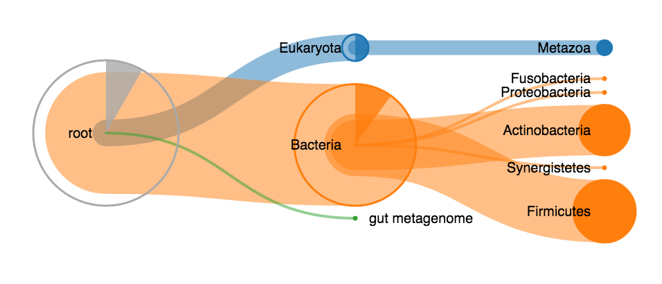

# Unipept visualizations

This repository contains stand-alone versions of the unipept visualizations. At this time, only a treeview is available. A treemap and sunburst graph should follow in the next releases.

A live example of this visualization can be found [on http://bl.ocks.org/bmesuere/162572f2d70c1a3a3e09](http://bl.ocks.org/bmesuere/162572f2d70c1a3a3e09) with additional examples in the examples directory.

## Requirements
[D3.js](https://d3js.org/) (version 3.x should do) and [jQuery](https://jquery.com/) are required to use these visualizations. The code is written using JavaScript ES2015 features, but a transpiled ES5-compatible version (`unipept-visualizations.min.js`) that should work in all modern browsers is available in the [`dist`](dist) directory.

Building your own version can be done by cloning this repository and running `grunt`.

## Installation and use
1. Download and include [`unipept-visualizations.min.js`](dist/unipept-visualizations.min.js) on your page
2. Include D3 and jQuery
3. Add a div with an id (for example `

`) to your page
4. Initialize the treeview by invoking the `treeview()` on the jQuery-selected div. For example `$("#example").treeview(data, options)`

### The data object
The data object is a hierarchical Node object. It consists out of:
* `id`: A way to uniquely identify the node
* `name`: The name of the node
* `data`: An object containing additional data of choice
* `children` (optional): An array containing one or more node objects that are the children of the current object

### The options object
The options object is an optional parameter and allows to override the default visualization settings.

#### Values
* `height` (default: 300): The height in pixels of the visualization.
* `width` (default: 600): The width in pixels of the visualization.
* `nodeDistance` (default: 180): The horizontal distance in pixels between nodes.
* `enableInnerArcs` (default: true): Should the inner arcs be shown?
* `enableTooltips` (default: true): Should tooltips be shown on mouseover?
* `enableExpandOnClick` (default: true): Should the tree collapse and expand when clicking on nodes? If disabled, the entire tree is automatically expanded when loaded.
* `enableRightClick` (default: true): Should the tree *reroot* when right clicking a node?

#### Functions
* `getTooltip`: Function that returns the html to use as tooltip for a node. Is called with a node as parameter. By default, the result of `getTooltipTitle` is used in a header tag and the result of `getTooltipText` is used in a paragraph tag.
* `getTooltipTitle`: Function that returns the text to use as tooltip title. Is called with a node as parameter. By default, the `name` attribute of the node is used.
* `getTooltipText`: Function that returns the text to use as tooltip text. Is called with a node as parameter. By default, the value of `data.count` the node is used.
* `colors`: Color (String) or function that returns a color to use as node color. Is called with a node as parameter. By default, the D3 `category10` color scale is used.
* `nodeFillColor`: Function that returns a color to use as fill color. Is called with a node as parameter. By default, the node color is used.
* `nodeStrokeColor`: Function that returns a color to use as stroke color. Is called with a node as parameter. By default, the node color is used.
* `linkStrokeColor`: Function that returns a color to use as link color between two nodes. Is called with an object containing a `source` and `target` node as parameter. By default, the target node color is used.
