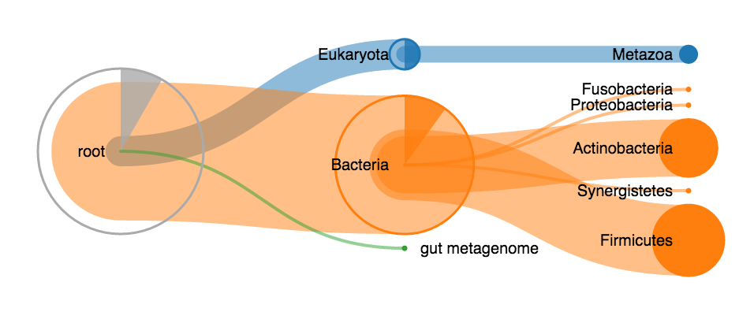
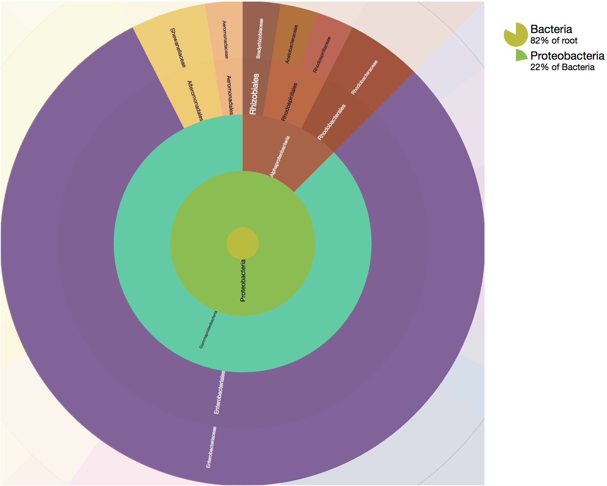
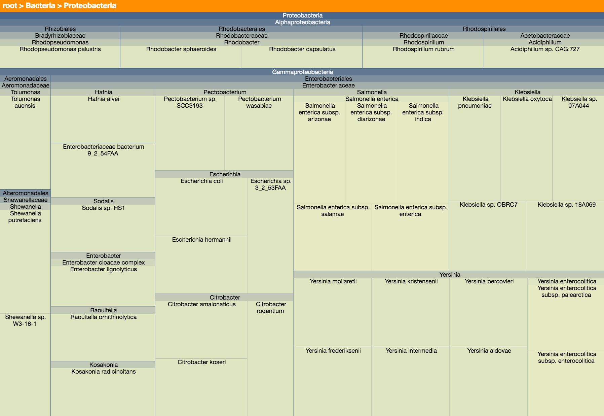
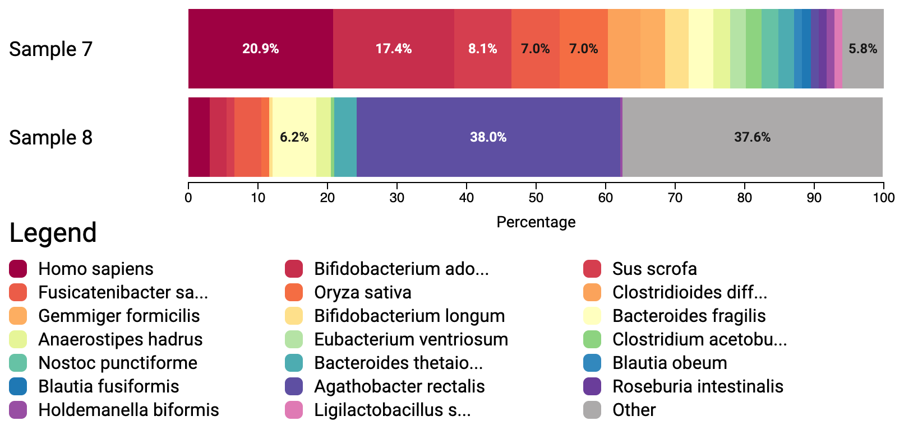
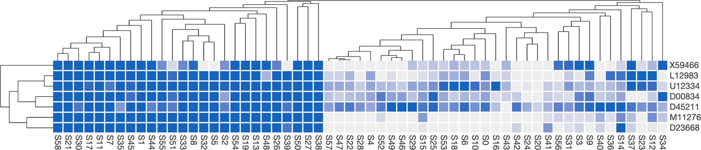

# Unipept Visualizations

[](https://www.npmjs.com/package/unipept-visualizations)
[](https://github.com/unipept/unipept-visualizations/actions/workflows/ci.yml)
[](LICENSE.md)

Stand-alone, reusable versions of the visualizations built for [Unipept](https://unipept.ugent.be): a treeview, a treemap, a sunburst, a heatmap and a barplot. Written in TypeScript on top of [D3](https://d3js.org) 7 and aimed at rendering large datasets quickly — SVG and plain DOM where that is fast enough, an HTML canvas where it is not.

**[Try them in your browser →](https://unipept.github.io/unipept-visualizations/)**

| | |
| --- | --- |
|  |  |
|  |  |



## Installation

```sh
npm install unipept-visualizations
```

D3 is bundled into the published file, so you do not need to load it separately.

## Usage

Every visualization is a class that renders into an element you give it, and takes an optional settings object:

```js
import { Treeview } from "unipept-visualizations";

new Treeview(document.getElementById("example"), data, {
    width: 900,
    height: 600,
    colorProviderLevels: 3,
});
```

`Treeview`, `Treemap` and `Sunburst` all take the same hierarchical data — a tree of nodes carrying at least a `count` and a `selfCount`, with `id`, `name` and `children` filled in for you when they are missing:

```js
const data = {
    id: 1,
    name: "root",
    count: 12,
    selfCount: 0,
    children: [
        { id: 2759, name: "Eukaryota", count: 7, selfCount: 2, children: [] },
        { id: 2, name: "Bacteria", count: 5, selfCount: 5 },
    ],
};
```

`Barplot` takes an array of bars, each with a label and its items:

```js
import { Barplot } from "unipept-visualizations";

new Barplot(document.getElementById("example"), [
    { label: "Sample 7", items: [{ label: "Blautia obeum", counts: 1 }] },
    { label: "Sample 8", items: [{ label: "Blautia obeum", counts: 4 }] },
]);
```

`Heatmap` takes a matrix and its labels:

```js
import { Heatmap } from "unipept-visualizations";

new Heatmap(document.getElementById("example"), values, rowLabels, columnLabels);
```

Without a bundler, import the package from a CDN as an ES module:

```html
<div id="example"></div>
<script type="module">
    import { Treeview } from "https://cdn.jsdelivr.net/npm/unipept-visualizations/+esm";
    new Treeview(document.getElementById("example"), data);
</script>
```

## Documentation

The settings for each visualization are documented on the [wiki](https://github.com/unipept/unipept-visualizations/wiki). The [`examples/`](examples) directory has a working page per visualization, and those are what the [live examples](https://unipept.github.io/unipept-visualizations/) are built from.

## Development

```sh
npm install
npm run build      # bundle and type declarations into dist/
npm test           # unit tests plus visual regression tests in a real browser
npm run lint
npm run typecheck
```

`npm run dev` serves the repository so the pages in [`examples/`](examples) can be opened against your working copy; see [examples/README.md](examples/README.md).

The visual regression tests screenshot the visualizations in Chromium and compare against `test/snapshots`. When a change is meant to alter what is drawn, delete the affected snapshot and let the next run record it, then check the new image before committing it.

## Releasing

Bump the version in `package.json`, commit, then push a matching tag:

```sh
git tag v2.2.6
git push origin v2.2.6
```

That runs [`publish.yml`](.github/workflows/publish.yml), which reruns CI, checks the tag against `package.json`, publishes to npm with provenance and creates the GitHub release. A prerelease tag such as `v3.0.0-rc.1` is published under the `next` dist-tag instead of `latest`.

## Citing

If you use this library in published work, please cite [Unipept Visualizations: an interactive visualization library for biological data](https://doi.org/10.1093/bioinformatics/btab590) (*Bioinformatics*, 2021). [`CITATION.cff`](CITATION.cff) has the machine-readable version.

## License

[MIT](LICENSE.md)
